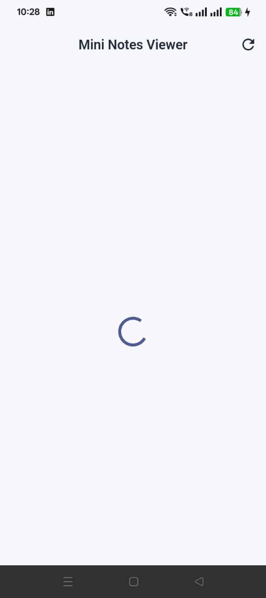
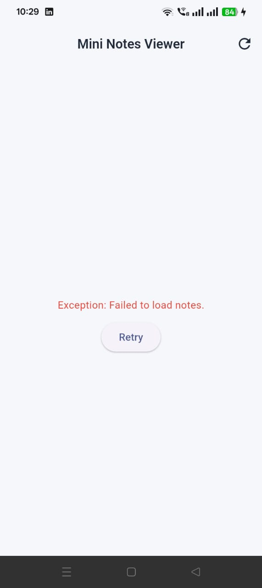
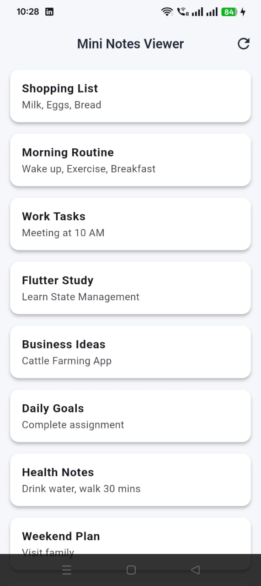

# 📒 Mini Notes Viewer — Flutter App

A clean and minimal Flutter application built as part of **Artificizen’s Flutter Assignment**.  
This app demonstrates clean architecture, async programming, error handling, and state management using **Provider**.


## 🚀 Features

- Fetches notes from a simulated service
- Artificial delay (1–2 seconds)
- 20% chance of simulated failure
- Handles all app states:
  - ✅ Loading
  - ❌ Error + Retry
  - 📄 Notes list
- Refresh button in AppBar
- Clean project structure
- Responsive UI with Material 3


## 📁 Project Structure

```text
lib/
 ├── core/
 │    └── theme/
 │         └── app_theme.dart
 │
 ├── models/
 │    └── note.dart
 │
 ├── services/
 │    └── notes_service.dart
 │
 ├── providers/
 │    └── notes_provider.dart
 │
 ├── screens/
 │    └── notes_screen.dart
 │
 ├── widgets/
 │    └── note_tile.dart
 │
 └── main.dart
 ```
 ## 🧠 State Management
This project uses Provider because it is lightweight and ideal for small to medium-sized apps.
Provider ensures clean separation between UI and business logic, making the code modular and testable.

## 🛠️ Tech Stack

Flutter (Material 3)

Provider (State Management)

Dart

## 📸 Screenshots








## 🧪 How to Run

Clone the repository:

git clone https://github.com/Mazharkhan123c/mini_notes_task_app.git


Move into the project folder:
```text
cd mini_notes_task_app
```
Install dependencies:
```text
flutter pub get
```

Run the app:
```text
flutter run
```
## 📄 Assignment Requirement Summary

This application was built according to the Artificizen Flutter assessment requirements:

Simulated notes service

Artificial delay

Random failure simulation

Clear loading, error, and notes UI

Refresh capability

State management with clean architecture

## 📘 Submission Explanation

I used Provider for state management because it is lightweight, easy to understand, and well-suited for small to medium-sized Flutter applications.
The app handles loading, success, and error states using a centralized provider, allowing the UI to react automatically to state changes.
A simulated notes service was implemented with an artificial delay and a random failure mechanism to mimic real-world API behavior.
Error states are displayed with a clear message and a retry option, ensuring a smooth user experience.
Additionally, the project follows a clean and modular structure with centralized theming using Material 3 for better maintainability and scalability.

## 👨‍💻 Author

**Mazhar Iqbal**

Flutter Developer

